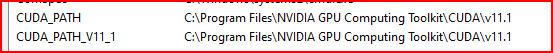

# How To Setup Jupyter in VsCode ?

1. you should install the Andaconda.

2. install the ipykernel 
```
conda install ipykernel
```


3. install the extension in vs code 
    [A]. python
    [B]. jupyter 


4. setup the jypyter in Vscode 
    [A]. create a file like test.ipynb 
    [B]. select a andaconda envirnoment kernel
    [C]. write the code


# How To setup Pytorch in GPU ?

1. download the cuda like this link
https://developer.nvidia.com/cuda-toolkit-archive

2. download the cuDnn like this link 
https://developer.nvidia.com/rdp/cudnn-archive#a-collapse811-111

3. download the visual sudio 
https://www.techspot.com/downloads/downloadnow/7241/?evp=70f51271955e6392571f575e301cd9a3&file=9642

    [A]. In the visual sudio in the bottom beside the install button check the all install 
    [B]. Then install the cuda and see the Visual studio are install or not 
    [C]. extract the folder of cuDnn and paste the file in cuda like this path: C:\Program Files\NVIDIA GPU Computing Toolkit\CUDA\v11.1
    [D]. check the Envirnomet Viriable path have or not like this 

    


4. Make sure you have the Anconda 

5. Download the pytorch 
- make sure check the version of cuda of same in the pytorch


